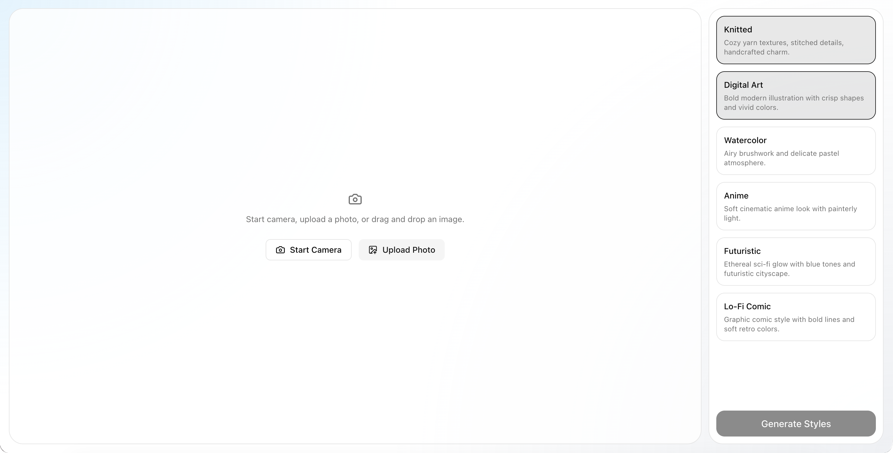

# ImageGen Photobooth Demo

[](./LICENSE)
[](https://nextjs.org/)
[](https://www.typescriptlang.org/)
[](https://tailwindcss.com/)

This repo contains a simple photobooth demo built with Next.js that lets you capture or upload a portrait and create multiple image styles using the [OpenAI Image API](https://developers.openai.com/api/reference/resources/images/methods/edit) in edit mode with the [GPT Image 2 model](https://developers.openai.com/api/docs/models/gpt-image-2).

Learn more about image generation and see examples in our [dedicated guide](https://developers.openai.com/api/docs/guides/image-generation).



## Features

- Image capture or upload
- Built-in style presets
- Integration with the OpenAI Image API
- Streaming partial image generations

## Tech stack

- Next.js (App Router)
- TypeScript
- Tailwind CSS + shadcn/ui primitives
- OpenAI Image API (`/images/edits`)

## How to use

1. Clone the repository

2. Copy `.env.example` to `.env.local`

```bash
cp .env.example .env.local
```

3. Add your OpenAI API key

```bash
OPENAI_API_KEY=""
```

Optionally, you can set your OpenAI API key as an environment variable.
Read our [quickstart](https://developers.openai.com/api/docs/quickstart) to learn more.

4. Install dependencies

```bash
npm install
```

5. Start the dev server.

```bash
npm run dev
```

The app should now be running at [http://localhost:3000](http://localhost:3000).

## Demo flow

1. Start camera and capture an image of yourself, or upload an image with people on the home screen.
2. Select up to 4 styles from the style panel.
3. Click `Generate Styles`.
4. Wait for the images to be fully generated on the results screen.
5. Click a result to preview it fullscreen.
6. Download any generated style.
7. Click `Create another set` to restart the flow.

## Customization

- Edit style labels/descriptions/prompts in `lib/photobooth-styles.ts`.
- Change default selected styles and limits in `lib/constants.ts`.
- Adjust generation model/size/quality defaults in `lib/constants.ts`.
- Tune layout and component styling in `components/photobooth/*`.

## Project structure

- `app/page.tsx`: home flow composition (capture + style selection).
- `app/results/page.tsx`: results flow composition (grid + modal).
- `app/api/photobooth/route.ts`: streaming image generation route.
- `components/photobooth/*`: reusable photobooth UI components.
- `hooks/use-photobooth-capture.ts`: capture/upload/drag logic.
- `hooks/use-photobooth-results.ts`: session + streaming results state.
- `lib/constants.ts`: centralized app constants.
- `lib/photobooth-styles.ts`: style catalog and prompts.
- `lib/sse.ts`: shared SSE parser/formatter.
- `services/imagegen-api.ts`: client-side streaming API integration.

## Contributing

You are welcome to open an issue or submit a pull request if you notice any bugs or have any suggestions for improvements.
However, we are not committing to accepting any changes at this time and will only periodically review and merge changes if they are deemed to be valuable.

## License

This project is licensed under the MIT License. See [LICENSE](./LICENSE) for more details.
You are free to use, modify, and distribute this project for any purpose, including commercial purposes.

Third-party notices, including Geist font attribution, are listed in
[THIRD_PARTY_NOTICES.md](./THIRD_PARTY_NOTICES.md).
